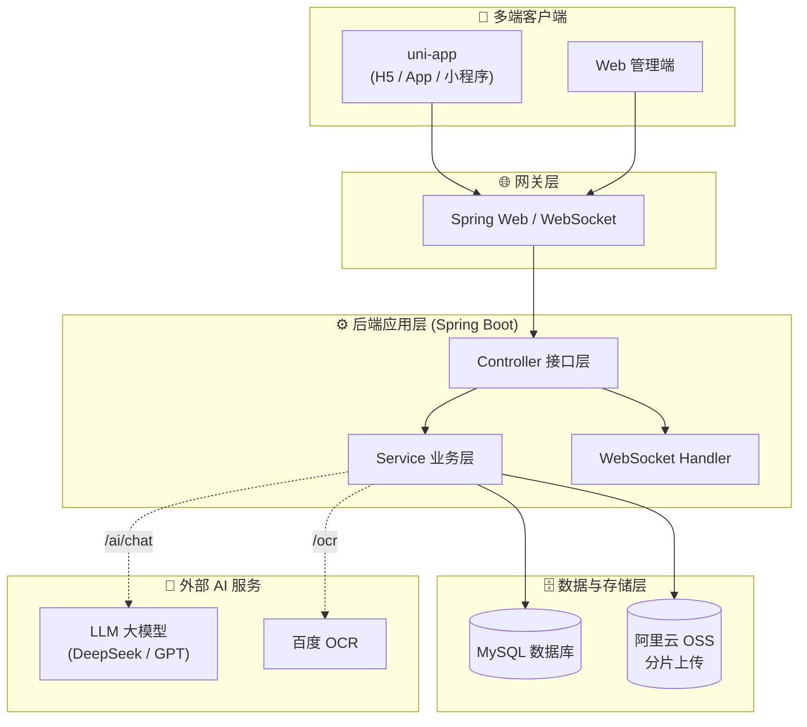

# 🎓 智慧校园墙 · AI 校园服务平台

<p align="center">
  <a href="https://github.com/wangwenlin333/smart-campus-wall">
    
  </a>
  <a href="https://github.com/wangwenlin333/smart-campus-wall">
    
  </a>
  <a href="https://github.com/wangwenlin333/smart-campus-wall/watchers">
    
  </a>
  <a href="https://github.com/wangwenlin333/smart-campus-wall/releases">
    
  </a>
  <a href="https://wangwenlin333.github.io/smart-campus-wall/">
    
  </a>
  <a href="https://github.com/wangwenlin333/smart-campus-wall/issues">
    
  </a>
</p>

<p align="center">
  
  
  
  
  
  
  
</p>

> 面向高校学生与教职工的**智能化校园综合服务平台**，将 **AI 大模型对话、AI 视觉 OCR、WebSocket 实时消息**与校园帖子、失物招领、社团活动等业务场景深度融合，构建一个有趣、好用、有温度的智慧校园数字底座。

---

## 🚀 在线 Demo

[]
(https://wangwenlin333.github.io/smart-campus-wall/)

> 纯静态项目主页 + 架构演示。因涉及数据库与外部 AI 密钥，登录级功能需本地部署完整后端体验。

---

## 📐 系统架构



---

## ✨ AI 能力亮点

### 1. 🤖 AI 校园助手（大模型对话）
- **HTTP 流式问答**：前端 uni-app 通过 `POST /ai/chat` 调用，后端封装统一接口。
- **多模型可切换**：兼容 OpenAI 协议，支持 `deepseek-chat` / `gpt-3.5-turbo` / 通义等主流模型，密钥集中管理在 `application.yml` 的 `ai.assistant` 节点。
- **典型问答场景**：校园办事指引、活动安排咨询、失物招领辅助描述。

```
┌──────────────┐     HTTP /ai/chat      ┌───────────────────────┐
│  uni-app     │ ─────────────────────▶ │ AiAssistantController │
│  前端        │ ◀───────────────────── │ AiAssistantService    │
└──────────────┘     回复流式返回        └────────┬──────────────┘
                                                  │
                                                  ▼
                                        ┌──────────────────┐
                                        │  LLM 大模型网关  │
                                        │ (DeepSeek/GPT)   │
                                        └──────────────────┘
```

### 2. 👁️ AI 视觉识别（百度 OCR）
- 集成 `com.baidu.aip.ocr.AipOcr`，自动识别上传图片的文字信息。
- 在**失物招领登记**、**票据图片解析**等场景下，自动提取关键要素（日期、编号、描述），避免用户逐条手动录入。
- 封装为 `BaiDuOcrUtil` 组件，配置 `baidu.ocr.app-id/api-key/secret-key` 即可使用。

### 3. ⚡ WebSocket 实时消息
- `ChatWebSocketHandler`：聊天消息实时推送。
- `DisputeCountWebSocketHandler`：订单争议/举报计数实时更新。

---

## 🧩 业务功能

| 模块 | 能力 |
| --- | --- |
| 校园墙 | 帖子发布、评论、点赞、软删除；订单取消申请计数；动态字段扩展 |
| 失物招领 | 寻物 / 拾遗发布与认领，**OCR 辅助快速登记** |
| 社团活动 | 活动发布、报名、组织管理 |
| 媒体上传 | 阿里云 OSS **分片上传**，支持大文件、断点续传 |
| 账号体系 | 注册 / 登录 / JWT 鉴权 |
| 实时通信 | WebSocket 推送聊天与业务计数 |

---

## 🚀 快速开始

### 后端
```bash
git clone https://github.com/wangwenlin333/smart-campus-wall.git
cd graduation_project

# 1. 初始化数据库：执行 graduation_project.sql 及根目录 add_*.sql 增量 DDL
# 2. 配置 AI / OCR 密钥（application.yml 或环境变量）
#    ai.assistant.api-key / base-url / model
#    baidu.ocr.app-id / api-key / secret-key
# 3. 启动
mvn spring-boot:run
```

### 前端（uni-app）
```bash
cd uni/uni-app
npm install
# 用 HBuilderX / uni-cli 编译到 H5 / App / 小程序
```

---

## 📁 目录结构

```
wallProject/
├─ graduation_project/            # Spring Boot 后端
│   └─ src/main/java/com/wwl/
│       ├─ controller/            # AiAssistantController 等
│       ├─ service/               # AiAssistantService / 业务服务
│       ├─ common/util/           # BaiDuOcrUtil、TicketPictureParseUtil
│       ├─ config/                # AiAssistantProperties 等
│       ├─ model/                 # 实体 / DTO
│       └─ websocket/handler/     # Chat / DisputeCount
├─ uni/uni-app/                   # uni-app 前端
└─ graduation_project.sql         # 数据库初始化
```

---

## 📜 说明

- 个人毕业设计项目，用于学习与演示。
- **AI 密钥请通过 `application.yml` 或环境变量注入，勿提交到仓库**。
- Demo 为静态演示页；完整登录 / 数据库 / AI 功能请本地部署后端体验。